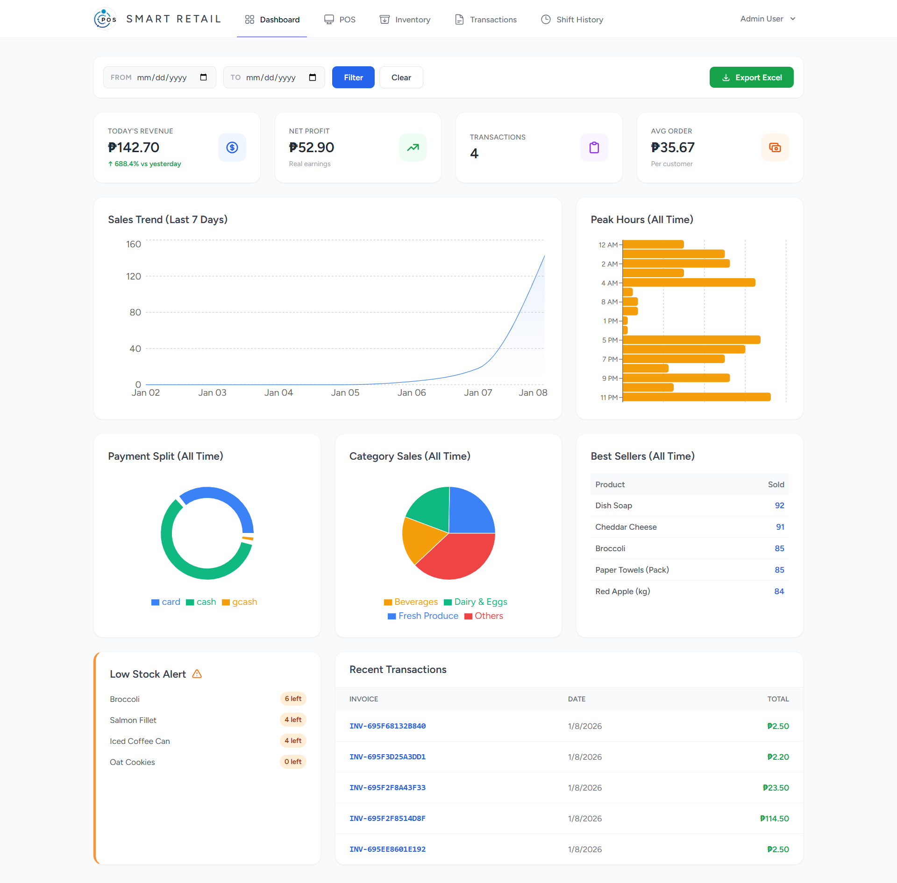
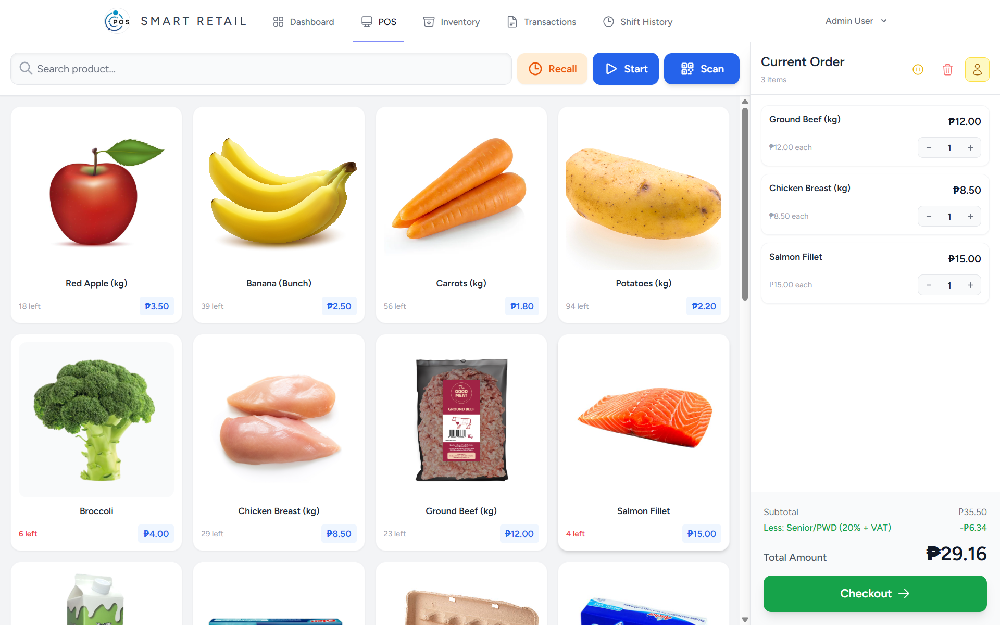
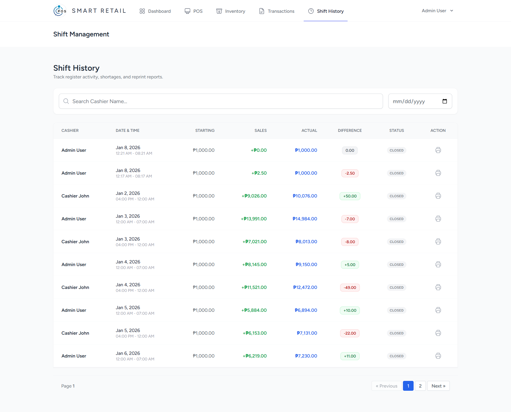
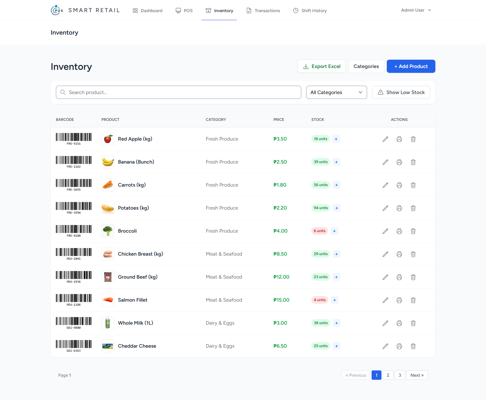
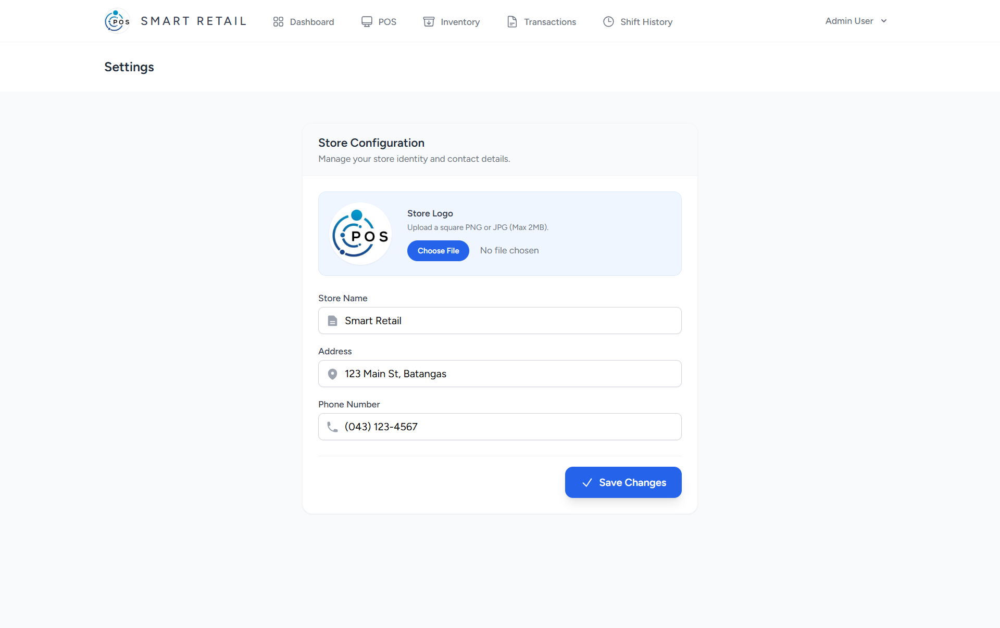

# 🛒 Laravel React POS System

A modern, full-stack Point of Sale (POS) system built with **Laravel 11**, **React**, and **Inertia.js**. Designed for grocery stores, cafes, and retail businesses with real-time inventory management, sales analytics, and thermal receipt printing.

## 🚀 Key Features

-   **⚡ Fast POS Terminal**:

    -   **Open & Close Shift**: Securely start and end shifts directly from the register.
    -   Barcode Scanning (via Camera or USB Scanner).
    -   Real-time Product Search & Category Filtering.
    -   **Hold & Recall Orders**: Save a customer's cart and resume it later.
    -   **Senior/PWD Discount**: Automatic 20% discount on VAT-exempt calculation.

-   **🕒 Shift Management**:

    -   **Cash Control**: Track Starting Cash, Cash Sales, and Closing Counts.
    -   **Z-Read Reports**: Print official end-of-day reports for thermal printers.
    -   **Audit History**: Admins can view past shifts, shortages, and overages.
    -   **Register Locking**: Prevents concurrent sessions on the same terminal.

-   **📊 Analytics Dashboard**:

    -   Daily Revenue, Profit, and Transaction counts.
    -   Sales Trend Charts & Peak Hours Heatmap.
    -   Top Selling Products & Payment Method Split.

-   **📦 Inventory Management**:

    -   Add/Edit/Delete Products with Images.
    -   **Low Stock Alerts** & CSV Export.
    -   Category Management.

-   **🧾 Transaction History**:

    -   View full sales history with search filters.
    -   **Void Transactions**: Automatically returns items to inventory.
    -   **Reprint Receipts**: Thermal printer compatible format.

-   **📱 Fully Responsive Design**:

    -   **Mobile Sidebar**: Smooth drawer navigation for mobile devices.
    -   **Tablet Mode**: Optimized icon-only navigation with floating tooltips.
    -   **Desktop**: Full-width data tables and sidebar layouts.

-   **🔐 Role-Based Access**:
    -   **Admin**: Full access to Dashboard, Settings, Shifts, and Inventory.
    -   **Cashier**: Restricted to POS Terminal only.

## 🛠️ Tech Stack

-   **Backend:** Laravel 11, MySQL
-   **Frontend:** React.js, Inertia.js, Tailwind CSS
-   **State Management:** Zustand (Persisted Cart)
-   **Components:** Headless UI, SweetAlert2, Recharts
-   **Hardware Support:** HTML5-QRCode Scanner, ESC/POS Receipt Styling

## 📸 Screenshots

-   **POS Terminal**
    Efficient checkout with barcode scanning, shift control, and hold order functionality.
    

-   **Shift Management**
    Track cash flow and print Z-Read reports.
    

-   **Inventory Management**
    Track stock levels, manage categories, and export reports.
    

-   **Transaction History**
    View daily sales, filter by date, and void transactions.
    

-   **Store Settings**
    Configure store details and upload custom logo.
    

---
